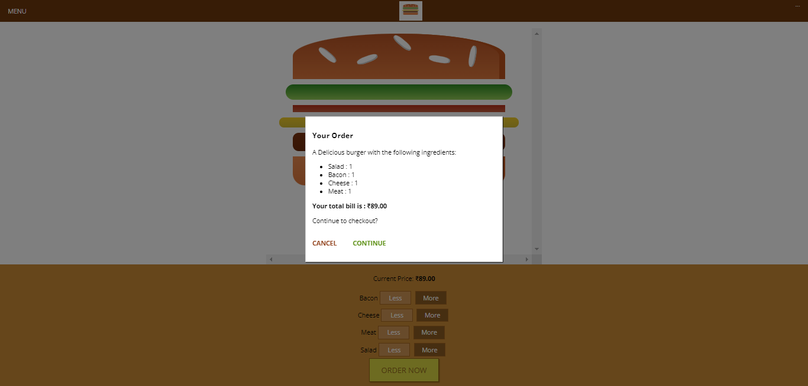

## Burger Builder using React.

Did you ever wanted to have a burger with only meat or salad or cheese(really?😅)
So, here you go my friend, this is Burger Builder, where you can build your own burger in affordable price!

choose what you want and remove what you don't want, it also saves your money too!

wondering how?
because now you only have to pay for what you really want to eat, and remove all those salad veggies etc.

So, you will enjoy your feast with your favorite feast(meat without veggies)
and good thing is you don't need to pay for salad now, even though you never wanted that!

isn't this budget effiecent and attractive?

#Here's the demo do give it a try!

https://quizzical-lovelace-42282c.netlify.app/

liked this project, don't forget to give it a Star🌟

# Here are some Screenshots:




## Run Locally

Clone the project

```bash
  git clone git@github.com:playstore777/burger_builder_using_reactjs.git
```

Go to the project directory

```bash
  cd burger_builder_using_reactjs
```

Install dependencies

```bash
  npm install
```

Start the server

```bash
  npm start
```
